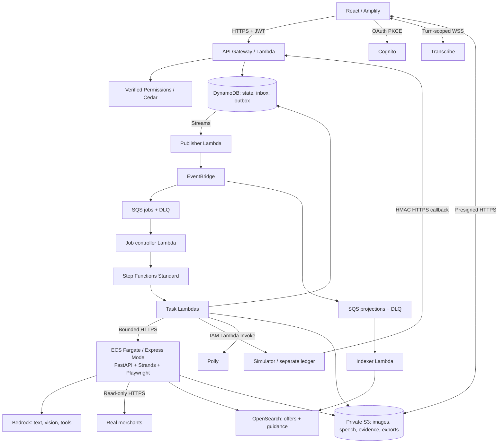
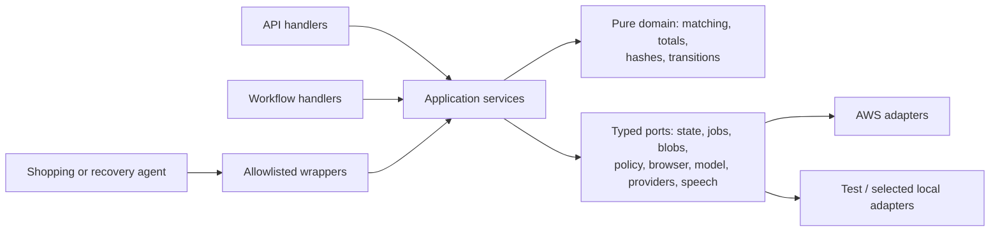
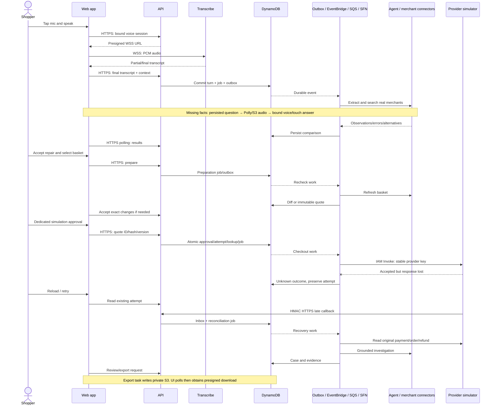
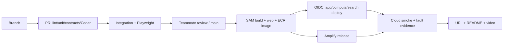

# ProofPath — Product and Engineering Specification

Product requirements and implementation plan · Four-person hackathon · **Ship It primary; early Build It contingency.**

> **Historical migration source — not a coequal authority.** The canonical product specification is [`docs/PROOFPATH-SPEC.md`](../docs/PROOFPATH-SPEC.md). This retained copy records the pre-migration source only.

Build a new application during the event using the scope, contracts and acceptance criteria below. This document is self-contained and specifies required behavior, not completed functionality.

## 1. Product and launch scope

**A voice-first, mobile-friendly web app that compares real grocery merchants, repairs baskets within user constraints, and demonstrates safe checkout and evidence-based payment recovery.** No native app.

**Live:** discovery, comparison, alternatives and rechecking. **Simulated:** checkout, payment, orders, callbacks and refunds. No money moves or retailer order is placed.

| Feature | Required behavior |
| --- | --- |
| Conversation | Tap mic, speak Indian English, see transcript; agent asks necessary questions aloud and accepts spoken answers. Typed input remains available. One active question; half-duplex, not always-on. |
| Photo list | One JPEG/PNG up to 5 MB; extract items, clarify uncertainties conversationally, then confirm with Yes/Change. |
| Usual basket | Save/update one list and preferences. Loading uses fresh observations, never old prices, approval or payment identity. |
| Live comparison | **Maximum four distinct items, two working merchants, one tested locality.** Extensible registry: evaluate Blinkit, Zepto, BigBasket and other suitable sources without promising universal access. |
| Matching/repair | Equivalent products and complete single-merchant baskets; permitted substitutions/pack combinations. Confirm before relaxing hard constraints. |
| Recheck/approval | Refresh selection, show and accept changes, then separately approve exact simulated seller/items/fees/total/expiry through a dedicated touch card. |
| Durable checkout | One logical attempt per approval; crashes/retries reuse its provider key. Unknown payment blocks a replacement attempt. |
| Recovery/export | Separate payment/order/refund facts; investigate original references; sourced guidance, editable draft, private timeline and reviewed/redacted HTML + JSON export. |
| Failure console | Operator role controls an independent provider simulator, replay and faults. Shopper cannot set outcomes. |

Voice, photo, usual basket, shopping and recovery are required. Additional merchants, larger baskets, languages, real payments, outside-payment receipt intake, split purchases, recurring buying, autonomous refunds and complaint submission are out of scope. No AP2 certification or bank-mandate claim.

**Honesty rules:** unknown fees are not zero; estimated totals never rank as definitively cheaper than verified totals. Payment screens show **“Simulated checkout · no money moved · no retailer order placed.”** If live access fails, preserve the actual error/time and offer an explicit switch to an entirely fixture-based result set. Never rank live and fixture prices together. Persist **“Demonstration data — fixture prices, not current retailer offers”** through comparison, quote and export. Fixtures do not satisfy the two-live-merchant gate.

## 2. Experience and UI

1. Shopper says: “Five kilos of rice, one litre of oil and two litres of milk under ₹900.” Agent asks only for missing location/preferences.
2. Two merchants return observations or explicit errors. If needed, the agent proposes a permitted brand/pack change; user reviews it.
3. Selected basket is refreshed. User accepts specific changes, then separately approves the exact **simulation** quote.
4. Simulator accepts payment but loses the response. Reload shows the same pending attempt; another click cannot create another payment.
5. A late callback confirms payment but order evidence is missing. Recovery queries original references and prepares a sourced support packet. Later order/refund evidence updates that case.

| Route | Purpose |
| --- | --- |
| `/` | Conversation: mic, captions, photo/usual list, questions and inline basket/approval/recovery cards. |
| `/searches/:id` | Comparison, source coverage, freshness, repair and recheck. |
| `/purchases/:id/approve` | Exact quote, change summary, expiry, approve/cancel. |
| `/purchases/:id` | Separate outcomes, progress, check-status and timeline. |
| `/cases/:id` | Known/missing facts, guidance, draft, redaction preview and export. |
| `/demo` | Operator-only simulator controls and effect counts. |

Reuse cards across routes; do not build six independent UI systems. Include loading/empty/partial/error states, keyboard access, mobile layout and preserved drafts. Spoken summaries stay short; exact terms remain visible. Generic Yes/No and spoken “buy it” cannot approve payment: only **“Approve simulated ₹X”** calls the approval endpoint.

## 3. HLD and AWS responsibilities



| Service | Concrete responsibility |
| --- | --- |
| Bedrock + Strands | Schema-constrained extraction, bounded shopping tool use and read-only recovery reasoning; no swarm. |
| Transcribe / Polly | Microphone transcription / audible persisted assistant questions and summaries. |
| Amplify / Cognito | Static hosting / authorization-code PKCE sign-in. |
| API Gateway / Lambda | User API, transaction/task handlers, callbacks, publisher, controller and indexer. |
| ECS Express Mode / Fargate / ECR | One agent/browser container, health check, managed HTTP entry point and commit-tagged images. No App Runner dependency. |
| Verified Permissions / Cedar | Owner/action/operator authorization outside the model. |
| DynamoDB | Canonical state, conditional writes and transactions; separate simulator ledger. |
| Step Functions Standard | Durable jobs, bounded parallel tasks, waits and explicit failures—not an external exactly-once-charge guarantee. |
| EventBridge / SQS | Route committed events to jobs/projections; buffer, retry and retain exhausted deliveries in DLQs. |
| OpenSearch | Rebuildable offer search and keyword guidance retrieval; never price/payment authority. Canonical fallback preserves correctness. |
| S3 | Private images, source extracts, speech, exports and versioned guidance snapshots. |
| CloudWatch / IAM / Secrets Manager | Correlated logs/metrics, least-privilege roles, rotated callback/internal-service secrets. |
| SAM / CloudFormation | Lambda build and infrastructure deployment; separate compute/search stacks isolate slow provisioning failures. |

OpenSearch provides retrieval; EventBridge routes events; SQS buffers deliveries. No additional PartyRock, Firecracker, Corretto or AgentCore dependency. During the initial checkpoint, record region/model ID, voice/engine, quotas, pinned versions and estimated standing compute/search cost. No cross-region calls by default.

Hosting rationale: [App Runner closed to new customers](https://aws.amazon.com/about-aws/whats-new/2026/03/aws-service-availability/); [AWS recommends ECS Express Mode](https://docs.aws.amazon.com/apprunner/latest/dg/apprunner-availability-change.html). Smoke-test both browser engines on Fargate early; do not assume desktop shared-memory or privileged-container flags work.

Browser engine is chosen per merchant connector, not globally: Zepto runs on **Lightpanda** (a from-scratch, non-Chromium engine — no CSS/image/font/GPU rendering cost, confirmed live at ~5s/search including JS execution and real price extraction). Blinkit stays on real **Chromium** via Playwright, because it sits behind Cloudflare bot management keyed off TLS fingerprint; Lightpanda's own policy refuses to impersonate a real browser's identity (confirmed live: Lightpanda gets an immediate 403 from Blinkit's Cloudflare edge, Chromium does not). Both engines run as one long-lived process per container, shared across tasks; only the browser context is created and torn down per task.

## 4. Communication contract

**No permanent WebSocket between the app and our backend.** Updates use HTTP polling. Only microphone transcription uses a turn-scoped WebSocket; HTTP connection reuse is not an application subscription.

| Caller → receiver | Protocol / lifetime | Authentication and failure behavior |
| --- | --- | --- |
| Browser → Amplify / Cognito | HTTPS assets; OAuth redirects/token requests | PKCE. API validates access-token issuer, client/audience claims, scopes and expiry. |
| Browser → API | HTTPS JSON, short request/response | JWT, idempotency key and expected version. Async 202 after durable commit. Poll every 2s then 5s; stop on terminal state/background. |
| Browser ↔ Transcribe | Presigned WSS, one utterance ≤60s | Backend-issued owner/context-bound session; PCM out, transcript in. Disconnect preserves editable text; no duplicate submission. |
| Browser ↔ S3 | Presigned HTTPS PUT/GET | Owner check before URL issue. Upload URL 10min, download 5min; verify bytes before processing. |
| API/tasks → DynamoDB/S3/AVP | AWS SDK HTTPS | IAM SigV4; Cedar for user actions. Conditional conflicts are domain errors, not blind retries. |
| DynamoDB Streams → publisher | Lambda event-source mapping reads batches | IAM; new-outbox-insert filter, failed-record retry; publication updates cannot loop. |
| Publisher → EventBridge → SQS | SDK PutEvents + managed async delivery | IAM/resource policies; check individual batch results. Target-delivery DLQ plus processing DLQs; at-least-once, deduplicate. |
| SQS → controller/indexer | Lambda event-source mapping long-polls | IAM; partial-batch failures. Acknowledge only after confirmed start/existing-run resolution or completed indexing. |
| Controller → Step Functions → tasks | SDK StartExecution; managed Lambda invocation | IAM; stable run identity, bounded retry/Catch. Persist results before completing tasks. |
| Task → agent container | HTTPS JSON via managed service endpoint; one bounded task | Rotated server-only token over TLS. Reload trusted record IDs/owner context; validate operation. Agent deadline 90s, worker timeout 100s; no background continuation. |
| Agent → Bedrock/OpenSearch/storage | SDK or SigV4 HTTPS | ECS task role; trusted owner/search filters, validated model schema. Index outage uses canonical fallback. |
| Agent → merchant (Chromium or Lightpanda, per connector) | Browser HTTPS in isolated context | Registered domains, verified locality; no CAPTCHA bypass or shopper credentials. Close context in finally. |
| Task → simulator | Synchronous AWS Lambda Invoke | IAM; typed operation. Only simulator writes its ledger. Lost response triggers same-key query. |
| Simulator → callback API | HTTPS POST; async relative to checkout | HMAC body/event/timestamp; durable inbox before 2xx; safe redelivery. |
| Speech task → Polly → S3 → browser | SDK synthesis returns bytes; task uploads; browser GET plays | Stored assistant caption only. Polly does not push to UI; failure retains captions/retry. |
| Modules within a process | Python function calls through typed ports | Pydantic contracts; not additional HTTP services. |
| GitHub Actions → AWS | OIDC/STS then SDK/CLI HTTPS | Repository/branch-scoped role; no long-lived keys; serialized deployment. |

## 5. LLD and repository

React/TypeScript/Vite; Python 3.12/Pydantic; FastAPI only in agent container; ASL workflow JSON; Cedar; OpenAPI-generated TypeScript types.



```text
proofpath/
├── README.md                         # setup, demo, boundaries, measured evidence
├── docs/PROOFPATH-SPEC.md             # this specification
├── contracts/openapi.yaml            # API/schemas; generated TS types
├── web/src/{pages,components,api}/    # shared cards, mic/audio, auth, polling
├── services/
│   ├── api/                          # Lambda HTTP entry points
│   ├── application/                  # use cases and typed ports
│   ├── domain/                       # pure rules; no AWS/browser imports
│   ├── agent/                        # FastAPI, Strands tools, Dockerfile
│   ├── merchants/                    # registry + independent connectors
│   ├── adapters/                     # AWS and deterministic test implementations
│   ├── workers/                      # tasks, publisher, controller, indexer
│   └── simulator/                    # separate ledger, scenarios, callback sender
├── workflows/                        # converse/speak/search/prepare/checkout/recovery/export
├── policies/                         # Cedar schema, policies, allow/deny fixtures
├── guidance/                         # rules, applicability, URLs, checked dates
├── infra/{template.yaml,compute.yaml,search.yaml,parameters/}
├── local/{compose.yaml,env.example}   # SAM/emulators, not full cloud parity
├── scripts/                          # dev/test/deploy/seed/retry/verify/cleanup
├── tests/{unit,contracts,integration,e2e,live}/
└── .github/workflows/{checks.yml,deploy.yml}
```

Shopping tools: `search_merchants`, `find_alternatives`, `evaluate_baskets`, `read_guidance`. Recovery: `read_case`, `query_payment`, `query_order`, `query_refund`, `read_guidance`. Wrappers resolve authorized server records. Agents propose; deterministic services validate/commit. No tools for approval, payment submission, refunds, unapproved preference changes, arbitrary URLs or code execution.

## 6. Data and adapter contracts

Opaque IDs; server-derived owner; UTC timestamps; INR integer paise. `Intent` means shopping request. `revision` is its counter; other concurrency counters use `version`. A claim is an application attempt lock, never a bank hold. `Approval` is consent; Cedar handles authorization.

| Record | Essential fields beyond ID/owner/timestamps |
| --- | --- |
| Intent / UsualBasket | Items `{id,name,quantity,unit,hard_attributes,flexibility}`, location, budget, delivery constraint; revision/version. UsualBasket excludes prices/payment state. |
| Conversation / Turn / Question | Active question/conversation version; turn text/input kind/reply-to/audio key; question kind/choices/proposed change, target ID/version, intent revision if applicable, expiry/status. |
| VoiceSession | Captured conversation ID/version, question ID, target ID/version, intent ID/revision if applicable; language, expiry/status, submitted transcript hash. Cannot rebind to a newer question. |
| Search / Observation | Revision/mode/progress; merchant/SKU/URL, pack/unit/price/stock, verified location/time, evidence key, extraction status. Mode `live|fixture`. |
| Basket / FeeAssessment | Line matches/quantities/substitutions/subtotal; fees bound to merchant/location/line hash/subtotal/time, charges/completeness. Total `complete|estimated|unknown`; fees are basket-level. |
| Preparation / CheckoutQuote | Preparation version/base basket/revision/refreshed facts/diff hash/expiry/acceptance; immutable quote version/demo seller/source merchant/exact lines/charges/total/currency/delivery/expiry/hash. |
| Approval / Purchase / Attempt | Approval exact quote/hash/version and consumed status; purchase active attempt/independent outcomes/version; attempt approval/provider key/request hash/dispatch state/start time/provider reference/next check/version. |
| ProviderLookup / Refund | Unique provider+key → purchase/attempt/expected seller/amount/currency; refund reference → purchase/attempt/amount/provider status. |
| Inbox / Evidence / Case | Immutable event ID/body hash/provider facts; source-linked evidence/timestamps; case known/missing facts/guidance versions/draft/status/version. |
| Job / Outbox | Job type/input hash/reference/status/stage/progress/result/error/run generation/execution ARN; event ID/type/aggregate version/reference/publication state. |

**DynamoDB:** one app table (`PK/SK`), separate simulator table. Partitions: `USER#id` (intents/usual/idempotency/exports), `CONVERSATION#id` (turns/questions), `VOICE#id`, `SEARCH#id` (observations/baskets/fees/repairs), `PURCHASE#id` (preparations/quotes/approvals/attempts/refunds/inbox/evidence/case), `JOB#id`, `OUTBOX#id`, `GUIDANCE#id`. Unique `PROVIDER#provider#key / LOOKUP` is conditionally created with its attempt. `ID#id / LOOKUP` resolves independently addressed child records. Owner-list GSI is for navigation; authorization reads primary records.

Private S3 owner prefixes: uploads 7 days, speech 24h, evidence/exports 30 days. App records/idempotency 30 days; expiry checks are application logic, not TTL timing. OpenSearch `offers-v1` injects trusted owner/search/location/freshness filters; `guidance-v1` stores source/version/applicability. Reload canonical facts before using index results.

```text
Merchant.search(location, item, deadline) -> observations / typed error
Merchant.refresh(location, sku, deadline) -> observation
Merchant.assess_fees(location, exact_lines, deadline) -> FeeAssessment / unknown
Payment.submit(provider_key, quote_hash, seller_id, total_paise, currency, expires_at) -> facts
Payment.query(provider_key) -> facts
Order.create(order_key, payment_reference, quote_hash) -> facts   # checkout only
Order.get(order_key) -> facts                                  # recovery read-only
Refund.query(refund_reference) -> facts                        # recovery read-only
```

Normalize compatible units only; never infer mass-to-volume conversions. Unknown attributes cannot satisfy hard constraints. Overbuying packs/brand changes must be explicit and permitted. Registry declares domains/location methods; test actual access conditions. Simulation fixture fees are labeled and must fit the approved budget. Preparation freshness and quote lifetime default to 120s each; configurable, always shown and checked server-side. SHA-256 binds canonical quote JSON including owner/purchase/version/seller/source/lines/charges/currency/delivery/expiry—not AP2 signing.

## 7. API and workflows

Responses: `{data,request_id}` / `{error:{code,message,details},request_id}`. Mutations require `Idempotency-Key`; same key/different payload → 409. Updates require expected version/revision; conflict → 409, invalid input → 422, expiry → 410, inaccessible resource → 404. Async commands return `202 {job_id,resource_id,status_url}` after atomic domain+job+outbox commit.

| Endpoint | Contract |
| --- | --- |
| `POST /conversations`; `GET /conversations/{id}` | Create/read owned conversation. |
| `POST /conversations/{id}/turns` | Text/upload + captured question/context versions → interpretation job. |
| `POST /conversations/{id}/questions/{qid}/answer` | Choice + conversation/target versions → atomic answer/change; never payment approval. |
| `GET /conversations/{id}/turns/{tid}/audio` | Stored assistant turn → playback URL or synthesis-job status. |
| `POST /uploads` | Restricted URL/ID; verify content before extraction. |
| `POST /voice/sessions`; `POST /voice/sessions/{id}/submit`; `DELETE /voice/sessions/{id}` | Bind context/issue WSS URL; submit final transcript once; cancel. |
| `POST /intents`; `PATCH /intents/{id}`; `GET/PUT /me/usual-basket` | Create/edit request; read/save usual list. |
| `POST /searches`; `GET /searches/{id}`; `POST /repairs/{id}/accept` | Search reviewed revision; read progress; accept explicit repair into new revision/fresh search. |
| `POST /purchases`; `GET /purchases/{id}` | Basket/revision → preparation job; read changes/quote/outcomes. |
| `POST /purchases/{id}/preparations/{version}/accept` | Exact diff hash + purchase version → accept refreshed terms/build quote if fresh; otherwise require new recheck. |
| `POST /purchases/{id}/approve` | Exact quote ID/hash/version + purchase version → consumed approval, attempt and checkout job atomically. |
| `POST /purchases/{id}/cancel`; `POST /purchases/{id}/reconcile` | Cancel before claim; or reconcile existing references without new payment. |
| `GET /jobs/{id}`; `POST /jobs/{id}/retry` | Progress; owner-authorized retry of terminal failed run, preserving business identities. |
| `GET /cases/{id}`; `PATCH /cases/{id}/draft` | Read case; edit draft, never provider facts. |
| `POST /cases/{id}/exports`; `GET /exports/{id}` | Reviewed fields/draft version → private HTML/JSON job and presigned downloads. |
| `POST /callbacks/simulator`; `POST /demo/scenarios` | HMAC provider ingestion; operator-only faults respectively. |

| Workflow | Stages |
| --- | --- |
| Converse / Speak | Validate final input → extract → schema check → persist turn/intent/question → synthesize caption. Complete clear request starts read-only search; photo requires summary confirmation. |
| Search | Validate → Map over **(merchant,item)** tasks, concurrency 2 → persist partial observations → basket fees → deterministic comparison → bounded repair → results. |
| Prepare | Refresh lines/fees → immutable preparation/diff → explicit acceptance if changed → quote. Fresh accepted preparation builds quote without an endless recheck loop. |
| Checkout | Load attempt → validate bound approval → conditionally mark dispatch started → submit/query same key → bounded polling → idempotent order creation after verified payment → reconcile/open case. |
| Recovery / Export | Read existing provider facts → deterministic reconciliation → applicable guidance → grounded draft; separate authorized/redacted export. |

**Delivery versus restart:** Streams → EventBridge → SQS starts `job_id-rN`. Duplicate delivery resolves the same run; it does not restart a failed execution. Retry atomically increments generation and writes outbox, preserving payment/order keys and completed effects. Workflows persist final/Catch status. `GET job` checks `DescribeExecution` for stale running records and repairs terminal status after timeouts/crashes. Operator outbox/DLQ replay alone cannot revive a terminal failed run. Event envelope carries event ID/schema/type/aggregate version/owner/time/reference; route job requests to jobs and observation/guidance changes to projections. Indexer ignores older versions.

## 8. Transaction invariants and end-to-end flow

- Approval transaction consumes exact consent, creates attempt + unique provider lookup + job/outbox/evidence and claims purchase conditionally. Cancel competes on the same version; repeated approval returns the existing attempt.
- Dispatch is `ready|started|expired_unsent`. Expiry while `ready` conditionally marks `expired_unsent`, clears the claim and requires fresh preparation/approval; no provider call occurred. Persist `started` before network submission. Thereafter a crash is ambiguous: query/reconcile the same key; never abandon it just because approval expired.
- Payment `not_started|claimed|pending|unknown|succeeded|failed`; order `not_created|pending|confirmed|failed|unknown`; refund `none|pending|completed|failed|unknown`. Resolution needs relevant order/refund evidence, not merely payment success. A failed job is not a failed payment.
- Simulator uniquely enforces payment/order keys: identical replay returns original facts even after expiry; changed payload conflicts. For a previously unseen payment key, atomically check expiry before accepting, recording an immutable expired/no-effect rejection if too late. After ambiguous dispatch, query first; if absent, resend only the same key/payload/expiry, never refreshed terms. Recovery never calls `Order.create`. Refund references originate in provider facts. No replacement attempt while payment exposure remains unresolved.
- Callback body is immutable. HMAC signs `delivery_timestamp + "\n" + event_id + "\n" + raw_body`; timestamp is a header, refreshed on redelivery. Reject >5-minute skew; match lookup/seller/amount/currency. Deduplicate provider+event ID/body hash; same ID/different body conflicts. Apply inbox processing/state/evidence atomically. Contradictory terminal facts require provider query; old pending cannot downgrade success.
- Poll 5s, 10s, 20s, then 30s up to a 3-minute observation window; afterwards retain/open case. Late callbacks enqueue reconciliation. Simulator scenarios: success, definitive failure, accept-then-timeout, paid/order-missing, duplicate/conflicting callback, refund pending→complete.
- Guidance carries reviewed official URL, version/date and applicability. Missing facts prompt questions, not invented statutory deadlines/refund promises. Simulator behavior is distinguished from real bank rules; exports never submit complaints.



## 9. Limits, security and acceptance

4 items, 2 merchants, concurrency 2, 45s/item fetch, 2 repair rounds, 6 model turns/job. Persist completed tasks; target first partial results within 90s, not guaranteed full completion. Agent requests finish within 90s; split work into tasks, never hidden background threads. Bound workflow timeouts and surface partial/failed results.

Voice: AudioWorklet → mono 16kHz signed 16-bit little-endian PCM with Transcribe event framing—not WebM. Assemble partials by result ID; only final Done submission starts work. Pause recognition during Polly playback; stop on leave/background; autoplay failure shows Play/captions. Question answer and domain change commit together; stale replies/audio cannot affect a new task.

Security: strict CORS, primary-record owner checks, operator-only faults, no secrets/cookies/OTP/PIN in prompts/logs. Treat page/image text as untrusted; restrict destinations including redirects/private addresses. Validate image type/dimensions, strip metadata and resize to model limits. Export redaction uses a field allowlist. Limit active jobs per user and service concurrency; budget alerts are not a spending cap.

**Test alongside implementation:**

| Group | Required evidence |
| --- | --- |
| Conversation | Voice→search; clarification/photo ambiguity; usual-list freshness; duplicate/stale answers; mic failure/disconnect; caption/playback fallback; spoken approval rejected. |
| Commerce | Two live location-verified sources; explicit errors; correct units/basket fees; hard constraints; repair revision; changed/expired preparation; fixture isolation. |
| Transactions | Concurrent approve/cancel; one simulator effect; expiry before dispatch; crash after dispatch/acceptance; unknown across reload; duplicate/conflicting/late callbacks; recovery never creates orders/payments. |
| Durability/access | Outbox replay, failed-run retry, DLQ recovery, index outage fallback, cross-user denial, export redaction, merchant prompt injection cannot bypass approval. |
| UI/deployment | Playwright desktop/mobile against actual backend and controlled simulator; separate live smoke tests; deployed end-to-end trace. |

## 10. Delivery and local development

**Target Ship It. End of first six implementation hours:** verify model/speech access, deployed frontend→authenticated API→database, cloud browser/locality smoke and one durable job. Bring unresolved blockers to the user for the switch decision. Merchant failure both locally and in cloud is not fixed by switching categories.

Daily development: Vite + SAM local API; LocalStack only for verified services/features in the available edition, initially DynamoDB/S3/SQS. Deterministic model/speech/provider fixtures in CI; real AWS manual smoke tests. **Do not build a second local workflow engine in parallel.**

If Build It is selected early, replace the release plan: choose/test local STT, TTS, image/tool model, persistence and resumable-job adapters against the same contracts. Define that concrete profile before implementing it. No claim that it already exists or SAM/LocalStack guarantees parity; live merchants still need internet. Late switching is not an assured fallback.

| Owner | Primary work | Explicit ownership |
| --- | --- | --- |
| 1 — Frontend/voice | Shared cards, mic/transcript, Polly playback, photo/usual UI; speech API/tasks with owner 4 setup support | Demo identity flow, storyboard, first recording day 3. |
| 2 — Agent/merchants | Container, connectors, matching/repair, extraction, grounded explanations | Two locality-tested sources early; browser limits/evidence. |
| 3 — Transactions/recovery | Schemas, approval, simulator, callbacks, Cedar, reconciliation, guidance/export | Small reviewed guidance corpus day 2; invariant/fault tests alongside handlers. |
| 4 — AWS/durability | SAM/stacks, hosting, jobs/outbox/queues/indexing, CI/monitoring | Early OpenSearch provision, cost tracking and explicit post-judging teardown. |

**Day 1:** checkpoint, contracts, voice loop, cloud skeleton and merchant tests. **Day 2:** shopping→recheck→approval→simulated happy path; photo/usual; transaction tests/guidance. **Day 3:** timeout/recovery/export, replay/security tests, first video; feature freeze by end of day. **Day 4:** protected fixes, regression, recording and submission—no new features/services. If behind, report failed gates rather than claim partial features complete.

Video (180s): problem 15; voice/clarification 25; live comparison/repair 30; photo/usual 15; exact approval 20; timeout/reload 25; recovery/export 30; AWS trace/effect count/limitations 20. Label edited waits. Seed two private test users and one operator; no credentials in Git; record signed in. Document evaluator sign-in without publishing operator credentials.



Scripts: `dev local-aws`, `test unit/integration/e2e/live`, `deploy cloud`, `verify cloud`, `seed demo`, `retry job`, `replay dlq`, `cleanup cloud`. Document PowerShell/Docker usage and verify actual LocalStack edition/feature coverage before relying on it. Lock dependencies; commit-tag images; PRs cannot deploy; serialize deployments; retain last working template/image. Ignore secrets, browser sessions, personal captures, exports and `.aws-sam`.

**Done:** working deployed app, new public repository, reproducible development setup, passing acceptance evidence, honest labels and three-minute video. No additional feature before this journey works reliably.

## 11. Industry grounding and implementation references

These eight references inform the design; they are not eight required integrations or proof of user demand. ProofPath's contribution is the implemented shopper-facing journey from exact approval to understandable payment/order recovery—not inventing agent payments or post-purchase events.

| Industry reference | Application in ProofPath | Boundary |
| --- | --- | --- |
| [OpenAI Instant Checkout / ACP](https://openai.com/index/buy-it-in-chatgpt/) | Explicit merchant, basket and checkout contracts. | Do not claim existing commerce agents universally stop before checkout. No ACP integration required. |
| [Stripe Shared Payment Tokens](https://docs.stripe.com/agentic-commerce/concepts/shared-payment-tokens) | Bind approval to seller, amount and expiry. | Our approval record is not a payment token or credential. |
| [Google AP2](https://cloud.google.com/blog/products/ai-machine-learning/announcing-agents-to-payments-ap2-protocol) | Preserve exact consent and outcome evidence together. | Application hashing is not AP2 compliance; AP2 is distinct from A2A. |
| [Google UCP order specification](https://ucp.dev/specification/shopping/order/) | Separate order lookup/events from payment state and reconcile post-purchase evidence. | Post-purchase management already exists; no UCP implementation required. |
| [Mastercard Agent Pay](https://newsroom.mastercard.com/news/press/2025/april/mastercard-unveils-agent-pay-pioneering-agentic-payments-technology-to-power-commerce-in-the-age-of-ai/) / [Verifiable Intent](https://www.mastercard.com/mt/en/news-and-trends/stories/2026/verifiable-intent.html) | Record acting identity, instructions and exact approval with evidence. | Cognito authentication does not make an agent Mastercard-registered. |
| [Visa Intelligent Commerce](https://www.visa.com/en-us/solutions/intelligent-commerce) | Keep credentials outside model context; separate recommendations from authorization. | No Visa integration or network protection implied. |
| [PayPal agentic commerce services](https://developer.paypal.com/agentic-commerce-services/about/) | Capability-based discovery/cart/provider adapters with explicit access limits. | Do not assume merchant onboarding or universal storefront access. |
| [AWS AgentCore Payments](https://aws.amazon.com/blogs/machine-learning/amazon-bedrock-agentcore-payments-is-now-generally-available-enabling-agents-to-transact-safely-and-autonomously-at-scale/) | Separate model reasoning from deterministic spending controls, execution and observability. | Architectural grounding, not a launch integration or evidence of native UPI recovery. |

Keep the full mapping in the README; use only the most relevant references in the three-minute pitch. Validate usefulness with the working fault demonstration and user feedback, not company-name counts.

Engineering references: [event stack](https://www.wemakedevs.org/aws/first-commit), [transactional outbox](https://docs.aws.amazon.com/prescriptive-guidance/latest/cloud-design-patterns/transactional-outbox.html), [DynamoDB transactions](https://docs.aws.amazon.com/amazondynamodb/latest/developerguide/transaction-apis.html), [Standard workflows](https://docs.aws.amazon.com/step-functions/latest/dg/choosing-workflow-type.html), [Transcribe](https://docs.aws.amazon.com/transcribe/latest/dg/streaming.html), [Polly](https://docs.aws.amazon.com/polly/latest/dg/what-is.html), [SAM local API](https://docs.aws.amazon.com/serverless-application-model/latest/developerguide/serverless-sam-cli-using-start-api.html).
