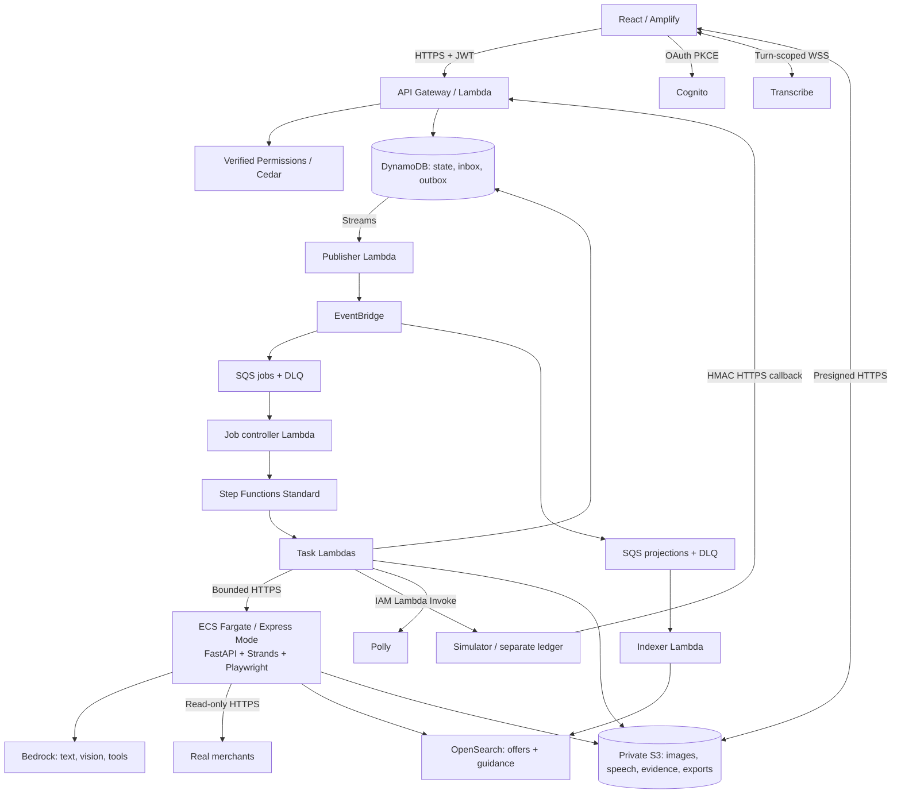

<p align="center">
  
</p>

# ProofPath

ProofPath is a voice-first web application for comparing locality-specific grocery baskets and demonstrating safe simulated checkout with evidence-based recovery. Checkout, payment, orders, callbacks, and refunds are simulated: **Simulated checkout · no money moved · no retailer order placed.**

> [!IMPORTANT]
> Discovery, comparison, alternatives, and rechecking use **live** merchant data (maximum four distinct items, two working merchants, one tested locality). Unknown fees are never treated as zero, and estimated totals never outrank verified ones.

The project is built by a four-person team through a sequence of reviewed work packages (WPs), each scoped, specified, implemented, and merged independently. See [Governance and authority](#governance-and-authority) for the documents that define scope and ownership, and [Project status](#project-status) for what is implemented today.

## What it does

1. Speak (or type) a list — "Five kilos of rice, one litre of oil, two litres of milk, under ₹900." The agent asks only for what's missing, such as location.
2. Two merchants are queried live. If an item is unavailable, the agent proposes a permitted brand or pack substitution for review.
3. The basket is rechecked before checkout; you accept any changed terms, then separately approve the exact simulated quote with a dedicated touch control — spoken "yes" or a generic confirm can never authorize payment.
4. If the simulator loses a response, reloading shows the same pending attempt; a retry cannot create a second payment.
5. When a late callback confirms payment but order evidence is missing, the recovery flow queries the original references and prepares a sourced, exportable support packet.

| Route | Purpose |
| --- | --- |
| `/` | Conversation: mic, captions, photo/usual-list input, questions, inline basket/approval/recovery cards. |
| `/searches/:id` | Comparison, source coverage, freshness, repair, and recheck. |
| `/purchases/:id/approve` | Exact quote, change summary, expiry, approve/cancel. |
| `/purchases/:id` | Independent payment/order/refund outcomes, progress, timeline. |
| `/cases/:id` | Known/missing facts, guidance, editable draft, redaction preview, export. |
| `/demo` | Operator-only provider-simulator controls and effect counts. |

## Architecture



| Service | Responsibility |
| --- | --- |
| Bedrock + Strands | Schema-constrained extraction and bounded, read-only shopping/recovery tool use — no autonomous swarm. |
| Transcribe / Polly | Microphone transcription and audible, persisted assistant questions/summaries. |
| Amplify / Cognito | Static hosting and authorization-code PKCE sign-in. |
| API Gateway / Lambda | User API, transaction/task handlers, callbacks, publisher, controller, indexer. |
| ECS Express Mode / Fargate / ECR | One agent/browser container with a managed HTTP entry point and commit-tagged images. |
| Verified Permissions / Cedar | Owner/action/operator authorization outside the model. |
| DynamoDB | Canonical state with conditional writes/transactions; a separate simulator ledger. |
| Step Functions Standard | Durable jobs, bounded parallel tasks, and explicit failure states. |
| EventBridge / SQS | Route committed events to jobs/projections with DLQ-backed retry. |
| OpenSearch | Rebuildable offer search and guidance retrieval — never the price/payment authority; canonical DynamoDB facts are reloaded before acting on index results. |
| S3 | Private images, source extracts, speech, exports, and versioned guidance snapshots. |

Communication is HTTP polling end to end — there is no permanent WebSocket between the app and the backend. The only WebSocket is a turn-scoped session used exclusively for microphone transcription.

### Repository layout

```text
proofpath/
├── contracts/openapi.yaml            # API/schemas; generated TS types
├── web/src/{pages,components,api}/    # shared cards, mic/audio, auth, polling
├── services/
│   ├── api/                          # Lambda HTTP entry points
│   ├── application/                  # use cases and typed ports
│   ├── domain/                       # pure rules; no AWS/browser imports
│   ├── agent/                        # FastAPI, Strands tools, Dockerfile
│   ├── merchants/                    # registry + independent connectors
│   ├── adapters/                     # AWS and deterministic test implementations
│   ├── workers/                      # tasks, publisher, controller, indexer
│   └── simulator/                    # separate ledger, scenarios, callback sender
├── workflows/                        # converse/speak/search/prepare/checkout/recovery/export
├── policies/                         # Cedar schema, policies, allow/deny fixtures
├── guidance/                         # rules, applicability, URLs, checked dates
├── infra/{template.yaml,compute.yaml,search.yaml,parameters/}
├── scripts/                          # dev/test/deploy/seed/retry/verify/cleanup
└── tests/{unit,contracts,integration,e2e,live}/
```

Dependency direction is one-way: `handler → application use case → domain → port → adapter`. Domain code stays pure — no AWS SDKs, browser libraries, or transport types — and every state transition or business rule has exactly one authoritative implementation.

## Governance and authority

- The settled product and architecture authority is [docs/PROOFPATH-SPEC.md](docs/PROOFPATH-SPEC.md).
- The execution plan, work packages, ownership, and review gates are in [Final idea and archi/PROOFPATH-IMPLEMENTATION-POA.md](Final%20idea%20and%20archi/PROOFPATH-IMPLEMENTATION-POA.md).
- [docs/STATUS.md](docs/STATUS.md) is the canonical package-status ledger; [LEARNING.md](LEARNING.md) is append-only.
- `ideation/` and the retained `Final idea and archi/PROOFPATH-SPEC.md` are historical material and are not implementation authority.
- [AGENTS.md](AGENTS.md) and [CLAUDE.md](CLAUDE.md) define the operating rules that all contributors and coding agents follow, including the ownership boundaries below.

## Project status

Work packages WP-00 through WP-09 are implemented and merged into `main`. In summary:

- **WP-00 (P4):** repository, toolchain, and contract baseline. PowerShell command surface, Vite web scaffold, SAM-based health Lambda, deterministic CI.
- **WP-01 (P4):** cloud viability checkpoint. AWS OIDC federation for CI, DynamoDB-backed checkpoint API behind Cognito, durable job/outbox chain, Bedrock/Polly/Transcribe adapters, Amplify hosting, OpenSearch template. Delivered as a conditional pass with two accepted, documented environmental exceptions (an AWS Organization service-control-policy restriction outside this project's control, and a merchant-side network block unrelated to the code).
- **WP-02 (P3):** core commerce domain. Pure domain rules, canonical hashing, and transaction-state invariants.
- **WP-03 (P1):** web shell, Cognito PKCE authentication, and a generated, typed API client.
- **WP-04 (P2):** agent container and live merchant connectors (Blinkit, Zepto).
- **WP-05 (P1):** text, voice, photo, and usual-basket intake, built against fixtures ahead of the real extraction and speech adapters.
- **WP-06 (P2):** search comparison and basket repair built on WP-02 and WP-04's extraction contract.
- **WP-07 (P4):** durable workflow and job-transport infrastructure supporting preparation, checkout, and recovery.
- **WP-08 (P3):** preparation, exact quote hashing, and the dedicated touch-approval control.
- **WP-09 (P3):** the simulated provider, durable checkout, and callback ingestion.

WP-10 (P4, callback reconciliation, recovery, guidance, case, and export) has not started; it is the sole remaining dependency for WP-11 (P1, the integrated UI journey and operator console). WP-12 (P4, release and teardown) follows once every preceding package is complete.

`docs/STATUS.md` carries the full acceptance-criteria detail per package; treat it, not this summary, as authoritative for any specific claim. See [`MVP-PATH.md`](MVP-PATH.md) for the current minimum-viable delivery path.

## Getting started

Install these exact prerequisite versions before setup: [Node.js `24.21.0`](https://nodejs.org/dist/v24.21.0/), npm `12.0.2` (`npm install --global npm@12.0.2`), [uv `0.12.13`](https://docs.astral.sh/uv/getting-started/installation/), [PowerShell 7](https://learn.microsoft.com/powershell/scripting/install/installing-powershell), and [SAM CLI `1.164.0`](https://docs.aws.amazon.com/serverless-application-model/latest/developerguide/install-sam-cli.html).

> [!NOTE]
> CPython `3.12.14` has no official binary installer on any platform: Python 3.12 entered upstream "security fixes only" mode and python.org only ships source tarballs for this version. Install it through uv's own toolchain instead of Homebrew/conda/pyenv:
>
> ```sh
> uv python install 3.12.14 --default
> python --version   # must print Python 3.12.14
> ```
>
> If a different Python still wins on `PATH`, ensure uv's shim directory takes priority.

Docker Desktop (or Docker Engine + `docker compose`) is only required for `build`, `dev`, and Gate A work — not for setup. If your platform's package manager for SAM CLI is broken or unavailable, `uv tool install aws-sam-cli==1.164.0` is a working platform-independent alternative.

```sh
pwsh ./scripts/proofpath.ps1 versions
pwsh ./scripts/proofpath.ps1 setup
```

`setup` verifies prerequisite versions, checksum-verifies Gitleaks into ignored `.tools/`, performs frozen `uv`/`npm` installs, and installs the pinned Playwright Chromium build. It never requests AWS or LocalStack credentials. Root `npm` aliases expose the same command surface; use the PowerShell interface as canonical.

### Running locally

```sh
pwsh ./scripts/proofpath.ps1 build
pwsh ./scripts/proofpath.ps1 dev
pwsh ./scripts/proofpath.ps1 web-smoke
```

`build` produces `web/dist` and a release-equivalent containerized SAM build, using an exact repository-controlled build image (updating the digest requires a reviewed spec change, not an opportunistic edit). `dev` starts the Vite scaffold at `http://127.0.0.1:5173` and the SAM Local health API at `http://127.0.0.1:3001/health` — Ctrl+C stops both. `web-smoke` starts those services with bounded readiness checks and runs a Chromium scaffold smoke test. None of these commands touch LocalStack or AWS credentials.

### Commands

All commands run through `pwsh ./scripts/proofpath.ps1 <command>` from the repository root (or the equivalent `npm run <command>` alias):

| Command | Purpose |
| --- | --- |
| `help`, `versions` | Command reference; verify pinned tool versions. |
| `setup` | Verified, frozen dependency installation. |
| `format`, `format-check`, `lint`, `typecheck` | Formatting and static analysis. |
| `test-unit`, `test-contract`, `test-integration`, `test` | Deterministic test suites (model/merchant/speech/provider adapters are faked in CI). |
| `build`, `dev`, `web-smoke` | Containerized SAM build, local dev servers, browser smoke test. |
| `security` | Gitleaks history scan, `pip-audit`, `npm audit`, ignore-rule sentinel checks. |
| `verify-gate-a` | Every non-mutating check in one pass, then asserts a clean tracked tree. |
| `verify-clean-clone` | `setup` followed by `verify-gate-a` from a fresh clone. |

`.github/workflows/checks.yml` runs the same command surface as required named CI jobs, using pinned action commit SHAs and no AWS or LocalStack credentials.

> [!WARNING]
> Any vulnerability or secret-scanner suppression must be recorded in [`security/suppressions.toml`](security/suppressions.toml) with an advisory ID, narrow scope, reason, owner, approval reference, and expiry date. The manifest starts empty; blanket suppressions are rejected and expired entries fail `security` outright.

## Ownership boundary

- **P1 (experience and voice)** owns `web/**`, shared UI cards, the polling client, text/voice/photo/usual-basket interactions, recovery and export presentation, accessibility, and frontend end-to-end scenarios.
- **P2 (shopping intelligence)** owns `services/agent/**` and `services/merchants/**`: extraction, merchant connectors, matching, normalization, fees, comparison, repair, and merchant evidence.
- **P3 (transaction safety)** owns transaction truth and semantics in `services/domain/**` and `services/simulator/**`: simulator behavior, provider-fact contracts, transaction-domain reconciliation rules, and commerce invariants.
- **P4 (platform, durability, and recovery)** owns `infra/**`, `policies/**`, `.github/**`: AWS adapters, job transport and workers, callback ingestion, durable reconciliation and recovery machinery, recovery handlers, the guidance/case/export backend, CI/CD, and releases.

Non-negotiable transaction-safety invariants (never weakened for a demo):

- Only the exact-price touch control labelled **"Approve simulated ₹X"** may call the approval endpoint — spoken approval, a generic "yes," or model output cannot.
- Payment, order, and refund are independent states; payment success does not prove an order exists.
- Duplicate requests, retries, and redelivered callbacks result in **at most one** irreversible simulator effect.
- A workflow/job failure is never treated as a payment failure.

Follow [AGENTS.md](AGENTS.md) and [CLAUDE.md](CLAUDE.md)'s approved work-package process before making changes.

## Industry grounding

ProofPath's contribution is the shopper-facing journey from exact approval to understandable payment/order recovery — not a claim of certification against any of these protocols.

| Reference | Applied as | Boundary |
| --- | --- | --- |
| [OpenAI Instant Checkout / ACP](https://openai.com/index/buy-it-in-chatgpt/) | Explicit merchant, basket, and checkout contracts. | No ACP integration required. |
| [Stripe Shared Payment Tokens](https://docs.stripe.com/agentic-commerce/concepts/shared-payment-tokens) | Bind approval to seller, amount, and expiry. | Our approval record is not a payment token or credential. |
| [Google AP2](https://cloud.google.com/blog/products/ai-machine-learning/announcing-agents-to-payments-ap2-protocol) | Preserve exact consent and outcome evidence together. | Application hashing is not AP2 compliance. |
| [Google UCP order specification](https://ucp.dev/specification/shopping/order/) | Separate order lookup/events from payment state; reconcile post-purchase evidence. | No UCP implementation required. |
| [Mastercard Agent Pay](https://newsroom.mastercard.com/news/press/2025/april/mastercard-unveils-agent-pay-pioneering-agentic-payments-technology-to-power-commerce-in-the-age-of-ai/) | Record acting identity, instructions, and exact approval with evidence. | Cognito authentication does not make an agent Mastercard-registered. |
| [Visa Intelligent Commerce](https://www.visa.com/en-us/solutions/intelligent-commerce) | Keep credentials outside model context; separate recommendation from authorization. | No Visa integration implied. |
| [PayPal agentic commerce services](https://developer.paypal.com/agentic-commerce-services/about/) | Capability-based discovery/cart/provider adapters with explicit access limits. | No assumed universal storefront access. |
| [AWS AgentCore Payments](https://aws.amazon.com/blogs/machine-learning/amazon-bedrock-agentcore-payments-is-now-generally-available-enabling-agents-to-transact-safely-and-autonomously-at-scale/) | Separate model reasoning from deterministic spending controls. | Architectural grounding only. |
