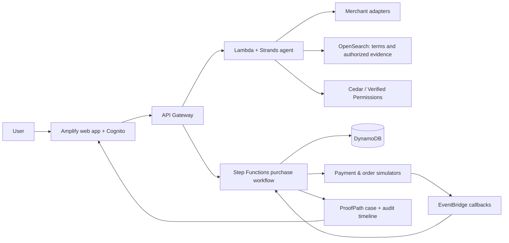

# Final verdict: ProofPath Commerce — Consent to Resolution

## Decision

Target **Ship It**.

The project is strongest when its safety properties are visible in a live system: authenticated identity, durable approval waits, atomic transaction updates, callback-driven reconciliation, and an auditable timeline. These are product behaviour, not incidental hosting details. Ship It also has the larger prize and considers cloud architecture as part of the score.

This recommendation assumes a team of at least two people, AWS access/credits available before the event, and a commitment to deploy a thin vertical slice by the second day. If either condition is not true, switch to Build It early and retain the same product behaviour with SAM Local, LocalStack, Cedar, Strands with Ollama, and a local database. Do not attempt both tracks in parallel.

## The final product

**ProofPath Commerce** is an agentic purchase assistant that carries an everyday shopping request from intent to a verified outcome.

It compares a basket from supported merchants, explains the recommendation, requests consent for the exact final purchase, and reconciles payment and order status separately. If a payment is unclear or the merchant has not confirmed the order, it creates a recovery case containing the evidence the user needs to understand or escalate the issue.

The agent can plan and recommend. It cannot spend simply because it has inferred that spending would be useful.

### Problem statement

People waste time comparing products, prices, quantities, delivery costs, and availability across commerce services. The more serious failure appears after checkout: a payment can be pending, fail, succeed without an order, or be reported twice. Users then have fragmented receipts, references, and support instructions, while no system shows what they authorized, what the agent did, and what happened next.

Existing shopping agents either stop at checkout or treat payment as a single success/failure response. Neither model gives users a complete, trustworthy purchase outcome.

How might an agent complete everyday commerce tasks while keeping payment under explicit user control and preserving enough evidence to resolve payment and order failures safely?

### The product promise

> “Tell ProofPath what you need. It finds a comparable basket, asks before the exact payment, and stays with the transaction until the order is verified or you have a clear recovery case.”

## The combined model

The prior documents contribute different halves of the right solution.

| Retain | Reason |
| --- | --- |
| Structured mandate | Turns a vague instruction into enforceable scope: user, budget, category, merchant constraints, delivery requirements, and expiry. |
| Cedar authorization | Separates agent reasoning from permission to access data, create a quote, request approval, or initiate the approved payment attempt. |
| Durable workflow and idempotency | Lets the transaction survive approval waits, timeout, retries, late callbacks, and duplicated requests. |
| Payment and order as separate states | Payment success alone is not proof that an order exists. |
| Recovery case and evidence packet | Gives the user a useful outcome when the happy path breaks. |
| Readable audit timeline | Shows request, quote, approval, policy decision, payment event, order event, and recovery evidence. |

### Deliberate product rule

A **mandate is a constraint, not a standing payment permission**.

Every payment attempt requires final approval for its exact quote: merchant, basket, quantity, total, currency, delivery details, and expiry. A changed quote requires a fresh approval. This retains the user control you described while still making the agent valuable before and after payment.

## The hackathon MVP

Support one grocery basket only, with **two test merchant adapters** and a payment/order simulator. The adapters must return complete delivered-price quotes: comparable units, product substitution, stock, delivery fee, and quote expiry. Label all simulated inputs clearly.

The demo request:

> “Find 5 kg rice and 1 litre oil under ₹900 including delivery. Show me the best option before paying.”

The system will:

1. Convert the request into a structured mandate and ask for missing material constraints.
2. Search two supported adapters and compare the final baskets.
3. Present a frozen quote and the reason for its recommendation.
4. Show an exact payment approval card.
5. On approval, create one idempotent payment attempt.
6. Reconcile payment and merchant order independently.
7. If unresolved, open a ProofPath case with timeline, references, known facts, missing evidence, and an exportable redacted support packet.

### Required demo scenarios

- A successful payment and confirmed order.
- Payment timeout followed by a late payment success.
- Payment success while order confirmation is still missing.
- A duplicate callback or repeated submit that has no duplicate effect.
- Quote changes after approval and requires another approval.
- A Cedar-denied action: an agent cannot initiate payment before the approval exists, and another user cannot view the recovery case.

## Ship It architecture

| Service | What it proves in the product |
| --- | --- |
| Amplify + Cognito | A real URL and authenticated owner of every mandate and recovery case. |
| API Gateway + Lambda | Public application APIs and typed merchant/payment adapter boundaries. |
| Strands + Bedrock | Intent parsing, comparison explanation, and source-backed recovery explanation. Model output never authorizes money movement. |
| Cedar / Amazon Verified Permissions | Authorization for sensitive actions and evidence access. |
| Step Functions | Durable waits for approval; bounded failure paths; reconciliation after callbacks. |
| DynamoDB | Transaction record, approval binding, conditional budget/state updates, and idempotency record. |
| EventBridge | Asynchronous payment/order events and late callback delivery. |
| OpenSearch | Search over authorized transaction evidence and stored recovery guidance. |

Keep the payment and merchant services as explicit simulators during the hackathon. Do not claim real Paytm, UPI, merchant, or universal web integration. If a permitted test integration becomes available, treat it as an optional adapter and retain the simulator as the reliable demo path. Paytm documentation itself says final transaction status should be verified server-side via its Transaction Status API, reinforcing the need for explicit reconciliation rather than trusting a client callback.

Relevant references:

- https://business.paytm.com/docs/miniapps/payment-flow
- https://business.paytm.com/docs/callback-and-webhook/
- https://strandsagents.com/docs/learning/switching-model-providers/
- https://docs.cedarpolicy.com/auth/authorization.html

## What we are intentionally cutting

- Real money and real credentials.
- Flights, hotels, movies, trains, recharge, and generic browser shopping.
- Claims of best price across every website.
- Autonomous payment under a low-risk threshold.
- Automatic refund/dispute filing or guaranteed resolution.
- AgentCore, SQS, and additional AWS products unless the required path already works. They do not improve the score if they weaken the demo.

The existing GenPay and MiraclePay repositories are research references only. Do not reuse their code, assets, or repository history. First Commit states that a project started before the event does not qualify even if rewritten. Because the new concept overlaps with prior agentic-commerce work, request an explicit organizer ruling before submitting it; build the new repository only after the event clock starts.

## Four-day delivery plan

| Day | Deliverable |
| --- | --- |
| 1 | New repository, deployment skeleton, identity, DynamoDB transaction model, two fixture merchant adapters, one quote screen. |
| 2 | Exact approval binding, Cedar decision, one idempotent simulated checkout, and first live URL. |
| 3 | Step Functions reconciliation flow, late callback / missing-order scenarios, recovery case, OpenSearch evidence retrieval. |
| 4 | Test all scenarios, refine the UI, record the three-minute video, complete README and submission early. |

## Three-minute demo

0:00–0:20 — The user asks for a grocery basket and budget.

0:20–0:55 — Two comparable baskets appear, with delivered totals and quote freshness.

0:55–1:20 — The user sees the exact approval card; an attempted pre-approval payment is visibly denied by Cedar.

1:20–1:55 — The approved checkout begins. Simulate a timeout and show that a second attempt is blocked while the first is reconciled.

1:55–2:30 — Simulate late payment success with no order confirmation. ProofPath opens the recovery case and exports a redacted evidence packet.

2:30–3:00 — Show the live URL, workflow state, policy decision, and AWS architecture; end on the verified order or recovery outcome.

## Final submission summary

**Problem:** Commerce agents can find products but cannot safely carry a user through payment and failures. Users lack proof of what was approved, whether payment settled, whether an order exists, and what to do when those outcomes disagree.

**Solution:** ProofPath Commerce converts an everyday shopping request into a bounded mandate, compares supported merchant baskets, requires final approval for the exact payment, reconciles payment and order state independently, and produces a recovery case when the result is uncertain.

**Why it wins:** It is not a generic shopping chatbot. It demonstrates the difficult boundary between an AI recommendation and a real financial action, then proves that the system remains useful when the happy path fails.
